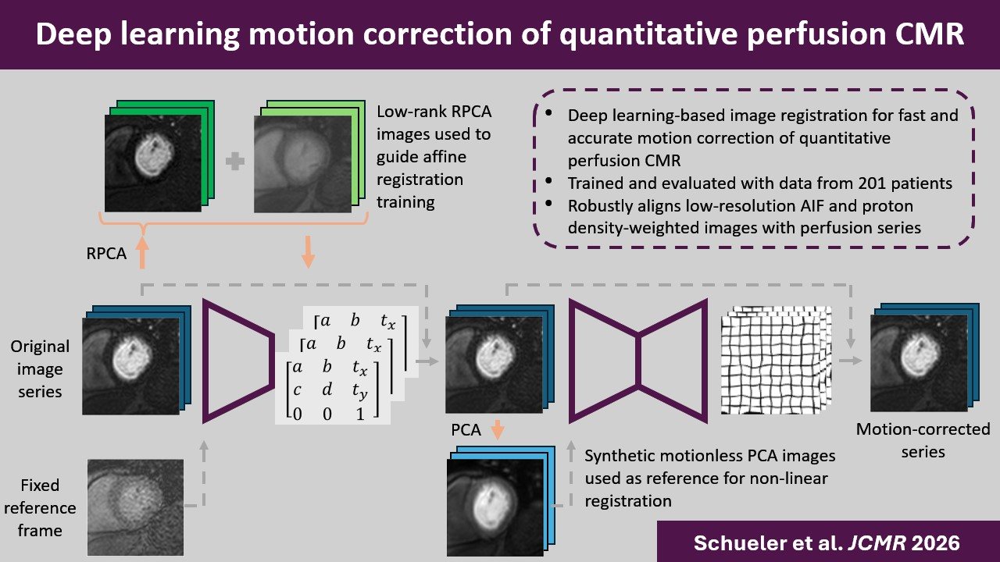

# Deep learning motion correction of quantitative stress perfusion cardiovascular magnetic resonance 
PyTorch implementation of our [paper](https://arxiv.org/abs/2510.00723), aiming to align contrast enhanced perfusion CMR images. 


# Repository structure
## Inference
Create an environment using `environemnt.yml`. 
Download the models via [this link](https://emckclac-my.sharepoint.com/:f:/g/personal/k1633520_kcl_ac_uk/IgDQ4YJ4_h15TqA2p3kroqURAdpj7lQm_wIwp_DDbVPviv4?e=fWUzAM)

Adapt your data to fit the data structure as described in `run.py` and run the file.

## Training
### Preparation
Data should be stored per patient. Every patient's data includes three or four slices (base, mid and apex slice and optional:low resolution acquisition of the base slice).
The slices should be sorted based on their timings and every slice has a different indication number in the file name. 
Example file name: img_{img_number_within_slice}_{slice_indication}

Preprocess images: 
- Identify LV_peak frame. This is the frame in the basal slice in which most contrast is present in the LV.
- Identify crop indices around the LV to crop the image to 128x128

Create a CSV file that includes the following line for every patient:
patient_folder_path | crop index 1 t/m 4 | LV_peak frame

### Training
There are four models that could be trained:
- `first_affine_reg`: model receives both MR images and is optimized using both the MR and low rank images. Low rank images are calculated using RPCA with a lambda 1/(sqrt(image.shape[0]*image.shape[1])). Make sure the MR images are saved in a folder with name `imgo` and corresponding low rank images are saved in folder `imgL`.
- `sec_affine_reg`: model receives both MR and PCA images of the output of the previous registration step. `prepare_input/calculate_pca_reference.py` can be used to calculate the firs 3 PCAs of the image stack. Make sure the MR images are saved in a folder with name `img` and corresponding PCA images are saved in folder `pca`.
- `non_rigid_reg`: model receives both MR and PCA images of the output of the previous registration step. Again, `prepare_input/calculate_pca_reference.py` can be used to calculate the firs 3 PCAs of the image stack. Make sure to calculate the PCA based on the 128x128 images and crop them to 96x96 afterwards. 
- `ablation`: model receives low rank images and calculates the loss using the current image and the low rank version of the LV_peak reference frame. 

Run `python first_affine_reg/train_affine_registration` --config_path {your_config_path} --config_nr {your_config_nr}
Adapt the config file from folder `configurations`.


## Citation
If you find our work useful in your research please consider citing our paper:
```@misc{schueler2025deeplearningmotioncorrection,
      title={Deep learning motion correction of quantitative stress perfusion cardiovascular magnetic resonance}, 
      author={Noortje I. P. Schueler and Nathan C. K. Wong and Richard J. Crawley and Josien P. W. Pluim and Amedeo Chiribiri and Cian M. Scannell},
      year={2025},
      eprint={2510.00723},
      archivePrefix={arXiv},
      primaryClass={cs.CV},
      url={https://arxiv.org/abs/2510.00723}, 
}```
